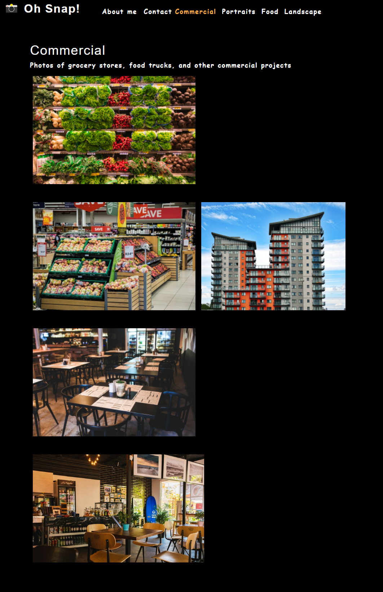
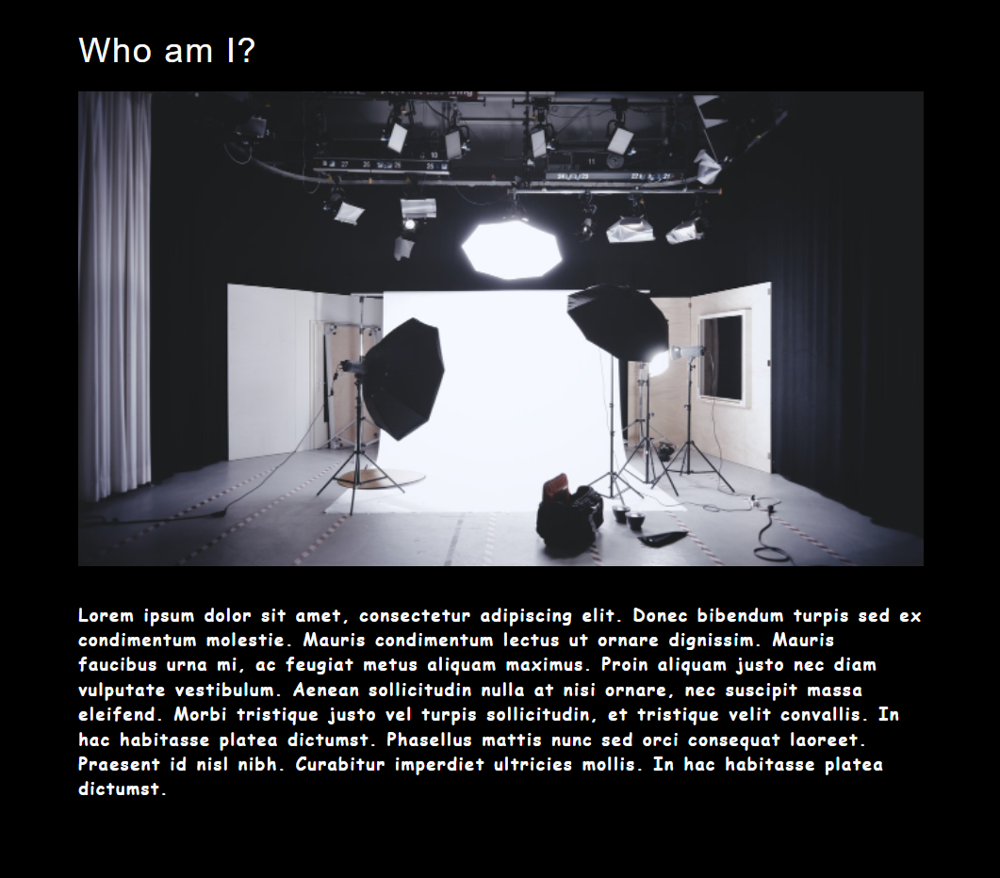

 </a>

<h3 align="center">Photo Port</h3>

---

## 

- [About](#about)
- [Installing](#installing)
- [Usage](#usage)
- [Built With](#built_using)
- [Authors](#authors)
- [Questions](#questions)
- [Screenshots](#screenshots)

## 

- Photo Port is a module designed to teach React.js.

## 

- Upon visiting the website you are presented with a header, photo section, and an about me section. The about me section is displayed at all times under the photo section. Clicking on any of the links in the header will present you with photos of that specific category.

## 

- Node.js
- React.js
- JSX
- Jest
- CSS
- Javascipt

## 

- [glenluersman](https://github.com/glenluersman)

## 

- Feel free to open an issue or contact me directly at glen.luersman@gmail.com if you have any questions about the repo. You can find more of my work at [glenluersman](https://github.com/glenluersman/).

## 

Deployed at URL: https://glenluersman.github.io/photo-port/

</a>

</a>